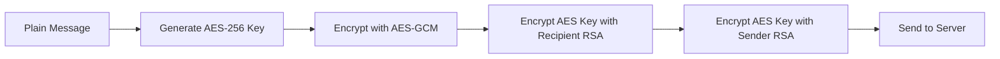

# 🔐 Arrluu - End-to-End Encrypted Real-Time Chat Application

A secure, scalable real-time messaging platform with client-side end-to-end encryption, built with modern technologies and enterprise-grade architecture.

# 🚀 Live Demo

https://arrluu.netlify.app

## ✨ Key Features

### 🔒 Security & Encryption
- **End-to-End Encryption (E2EE)** - RSA-OAEP + AES-GCM hybrid encryption
- **Client-Side Key Generation** - Private keys never leave the client
- **Password-Based Key Derivation** - PBKDF2 with 100,000 iterations
- **JWT Authentication** - Secure session management with HTTP-only cookies
- **Input Sanitization** - XSS and injection attack protection
- **Rate Limiting** - Configurable limits for different endpoints
- **Security Headers** - Comprehensive protection with Helmet.js

### ⚡ Real-Time Communication
- **WebSocket Integration** - Instant message delivery with Socket.IO
- **Message Queue System** - BullMQ for reliable message processing
- **Online Status** - Real-time user presence tracking
- **Type-Safe Sockets** - Custom TypeScript Socket.IO wrapper
- **Image Sharing** - Encrypted image uploads with Cloudinary

### 🚀 Performance & Scalability
- **Redis Integration** - Caching and queue management
- **Database Optimization** - Compound indexes and query optimization
- **LRU Key Caching** - Efficient cryptographic key management
- **Batch Processing** - Batch message decryption to prevent UI blocking
- **Performance Monitoring** - Request timing and slow operation detection
- **Graceful Shutdown** - Proper resource cleanup

### 🎨 User Experience
- **Responsive Design** - Modern UI with Tailwind CSS v4 and DaisyUI
- **Multiple Themes** - Customizable appearance
- **Progressive Web App** - Mobile-optimized experience
- **Error Boundaries** - Graceful error handling and recovery

## 🏗️ Architecture Overview

### Tech Stack

#### Frontend
- **React 19** with TypeScript and Vite
- **State Management**: Zustand
- **Styling**: Tailwind CSS v4, DaisyUI
- **Real-time**: Socket.IO Client
- **HTTP Client**: Axios
- **Cryptography**: Web Crypto API
- **Storage**: IndexedDB for secure key storage

#### Backend
- **Node.js** with TypeScript and Express.js
- **Database**: MongoDB with Mongoose ODM
- **Cache/Queue**: Redis with BullMQ
- **Authentication**: JWT with bcryptjs
- **Validation**: Zod schema validation
- **File Upload**: Cloudinary integration
- **Real-time**: Socket.IO
- **Logging**: Winston

## 📁 Project Structure

```
arrluu/
├── backend/                 # Node.js backend server
│   ├── src/
│   │   ├── controllers/     # Request handlers
│   │   ├── middlewares/     # Custom middleware stack
│   │   ├── models/          # Database schemas
│   │   ├── routes/          # API endpoints
│   │   ├── lib/             # Core utilities
│   │   ├── exceptions/      # Custom error classes
│   │   ├── schema/          # Validation schemas
│   │   └── index.ts         # Server entry point
│   └── package.json
├── frontend/                # React frontend application
│   ├── src/
│   │   ├── components/      # React components
│   │   ├── hooks/           # Custom React hooks
│   │   ├── lib/             # Crypto & utility functions
│   │   ├── pages/           # Route components
│   │   ├── store/           # Zustand state stores
│   │   └── types/           # TypeScript definitions
│   └── package.json
└── package.json             # Root build scripts
```

## 🔐 Encryption Architecture

### Security Model
The application implements **true end-to-end encryption** where:
- 🔑 **Private keys never leave the client**
- 🔒 **Server cannot decrypt any messages**  
- 💻 **All encryption/decryption happens client-side**
- 🛡️ **Each message uses a unique encryption key**

### Encryption Flow

#### Message Encryption (Client-Side)


#### Key Management
1. **Registration**: Generate RSA-2048 key pair client-side
2. **Private Key Storage**: Encrypt with user password, store on server
3. **Local Storage**: Decrypt and cache in IndexedDB
4. **Public Key Exchange**: Share public keys via server

### Cryptographic Specifications
- **Asymmetric**: RSA-OAEP 2048-bit with SHA-256
- **Symmetric**: AES-GCM 256-bit
- **Key Derivation**: PBKDF2 with 100,000 iterations
- **Random Generation**: Crypto-secure random values

## 🚀 Quick Start

### Prerequisites
- **Node.js** v18 or higher
- **MongoDB** database
- **Redis** server
- **Cloudinary** account (for image uploads)

### Installation

1. **Clone the repository**
   ```bash
   git clone https://github.com/waiphy0aung/Arrluu.git
   cd Arrluu
   ```

2. **Install dependencies**
   ```bash
   npm run build  # Installs both frontend and backend dependencies
   ```

3. **Environment Configuration**

   **Backend (.env)**
   ```env
   NODE_ENV=development
   PORT=5001
   MONGODB_URI=mongodb://localhost:27017/arrluu-chat
   REDIS_URI=redis://localhost:6379
   JWT_SECRET=your-super-secret-jwt-key
   CLOUDINARY_CLOUD_NAME=your-cloud-name
   CLOUDINARY_API_KEY=your-api-key
   CLOUDINARY_API_SECRET=your-api-secret
   FRONTEND_URL=http://localhost:5173
   ```

4. **Start the application**
   ```bash
   # Development (run both servers)
   cd backend && npm run dev    # Terminal 1
   cd frontend && npm run dev   # Terminal 2
   
   # Production
   npm start  # Runs built application
   ```

5. **Access the application**
   - Frontend: http://localhost:5173
   - Backend API: http://localhost:5001/api

## 📡 API Documentation

### Authentication Endpoints
| Method | Endpoint | Description |
|--------|----------|-------------|
| POST | `/api/auth/signup` | User registration with key generation |
| POST | `/api/auth/login` | User login and key retrieval |
| POST | `/api/auth/logout` | Secure logout |
| GET | `/api/auth/check` | Verify authentication status |
| PUT | `/api/auth/update-profile` | Update user profile |

### Messaging Endpoints
| Method | Endpoint | Description |
|--------|----------|-------------|
| GET | `/api/messages/users` | Get available users |
| GET | `/api/messages/:id` | Get conversation history |
| POST | `/api/messages/send/:id` | Send encrypted message |

### Key Management
| Method | Endpoint | Description |
|--------|----------|-------------|
| POST | `/api/key` | Save encrypted private key |
| GET | `/api/key` | Retrieve encrypted private key |

### Health Monitoring
| Method | Endpoint | Description |
|--------|----------|-------------|
| GET | `/api/health` | Complete system health |
| GET | `/api/health/database` | Database connectivity |
| GET | `/api/health/redis` | Redis status |
| GET | `/api/health/queue` | Message queue health |

## 🔧 Configuration

### Rate Limiting
- **General API**: 100 requests per 15 minutes
- **Authentication**: 5 attempts per 15 minutes
- **Messages**: 30 messages per minute
- **File Upload**: 10 uploads per hour

### Security Headers
- Content Security Policy (CSP)
- HTTP Strict Transport Security (HSTS)
- X-Frame-Options: DENY
- X-Content-Type-Options: nosniff

### Performance Optimizations
- **Message Batching**: Process 10 messages per batch
- **Key Caching**: LRU cache with 30-minute TTL
- **Connection Pooling**: MongoDB and Redis optimization
- **Compression**: Gzip response compression

## 🏗️ Development

### Frontend Development
```bash
cd frontend
npm run dev      # Development server
npm run build    # Production build
npm run lint     # Code linting
npm run preview  # Preview build
```

### Backend Development
```bash
cd backend
npm run dev      # Development with nodemon
npm run build    # TypeScript compilation
npm start        # Production server
npm run test     # Run tests
```

### Code Quality
- **TypeScript**: Strict mode enabled
- **ESLint**: React and TypeScript rules
- **Zod**: Runtime validation
- **Error Boundaries**: Comprehensive error handling

## 📊 Monitoring & Observability

### Performance Metrics
- **Crypto Operations**: Track encryption/decryption timing
- **Database Queries**: Monitor slow queries (>1000ms)
- **WebSocket Events**: Real-time connection monitoring
- **Memory Usage**: Track key cache and memory leaks

### Health Checks
- **Database**: Connection and response time
- **Redis**: Availability and latency
- **Message Queue**: Processing status
- **Overall Health**: Composite health scoring

### Logging
- **Structured JSON**: Production-ready logging
- **Winston Integration**: Multiple transport options
- **Error Tracking**: Detailed error context
- **Performance Logs**: Request timing and bottlenecks

## 🚀 Deployment

### Production Build
```bash
# Build entire application
npm run build

# Start production server
npm start
```

## 🔒 Security Considerations

### What's Secure ✅
- Messages encrypted end-to-end
- Private keys generated and stored client-side
- Server cannot read message content
- Password-based key encryption
- Secure session management
- Input sanitization and validation
- Rate limiting and DDoS protection

### Security Best Practices
- Regular security audits
- Dependency vulnerability scanning
- Secure coding practices
- Error message sanitization
- Logging security events

## 🤝 Contributing

1. Fork the repository
2. Create your feature branch (`git checkout -b feature/amazing-feature`)
3. Make your changes with tests
4. Commit your changes (`git commit -m 'Add amazing feature'`)
5. Push to the branch (`git push origin feature/amazing-feature`)
6. Open a Pull Request

### Development Guidelines
- Follow TypeScript strict mode
- Add tests for new features
- Update documentation
- Follow existing code patterns
- Ensure security best practices

## 🔮 Roadmap

### Planned Features
- [ ] Forgot password
- [ ] Email verification
- [ ] Group messaging with multi-party encryption
- [ ] File encryption and secure sharing
- [ ] Message search with client-side indexing
- [ ] Mobile application (React Native)
- [ ] Voice/video calling integration
- [ ] Message deletion and editing
- [ ] Push notifications
- [ ] Desktop application (Electron)

### Performance Improvements
- [ ] Message pagination and virtualization
- [ ] Advanced caching strategies
- [ ] WebRTC for direct peer-to-peer messaging
- [ ] Database sharding for scalability

---

